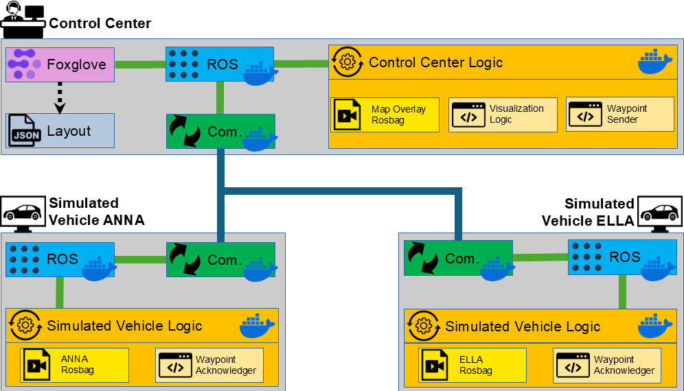

# Fleet Management for Autonomous Mobility

This is the first open-source fleet management system for autonomous mobility. It enables you to receive visualized data from your fleet, select individual vehicles to assist, and send them instructions. This allows for effective management and monitoring of autonomous vehicle fleets and provides a foundation for future developments in this field.

The system is based on ROS (Robot Operating System) and uses Foxglove for visualization, with communication between components managed by [ros_communication_devcontainer](https://github.com/fzi-forschungszentrum-informatik/ros_communication_devcontainer). It has been proven in real fleet operations across different locations, offering a solid foundation for developers and researchers working on autonomous vehicles and fleet management systems.

Key Characteristics
- Minimal Requirements: No specific ROS or Ubuntu version needed due to Docker abstraction; supports communication over any network (VPN, Wi-Fi, mobile, LAN).
- Modularity: Create custom compositions with own data, UIs, and scripts while maintaining the core structure.
- Debugging and Monitoring: Scripts run in structured tmux sessions for in-depth technical analysis.

## Requirements

### Install catmux

[Catmux](https://github.com/fmauch/catmux) simplifies the launch of multiple terminal scripts in separate windows.

```bash
sudo apt install python3-venv pipx
pipx install catmux
```

### Enable Docker Usage without sudo
```bash
sudo usermod -aG docker $USER
newgrp docker
```

# Get and initialize the repository
```bash
git clone git@ids-git.fzi.de:cognitive-cars/fleet_mgmt.git
cd fleet_mgmt
git submodule update --init --recursive
./re_init/re_init.py
```

# Demo


To help you get started quickly, we provide a demo that shows the core capabilities of the fleet management framework. This example showcases fleet management for two simulated vehicles and is the easiest way to experience the system's functionality. It does not require an autonomous driving stack, instead using recorded data. 

## Understanding the Example Architecture


The architecture, consists of a Control Center and two Simulated Vehicles (ANNA and ELLA). Most components run in Docker containers for isolation and consistency. The Control Center and vehicles communicate bidirectionally, enabling the operator to send instructions and receive acknowledgments. This setup demonstrates how the framework facilitates interaction between the control center and the fleet, showcasing its core capabilities.

## Setting Up Machines
The demo comprises three machines:
1. Control center (Machine A)
2. Simulated vehicle "ELLA" (Machine B)
3. Simulated vehicle "ANNA" (Machine C)

### Steps:
- **Install Foxglove:**
    - Install the [foxglove desktop application](https://foxglove.dev/download) on Machine A: 
    - Registration/login may be required; the free version suffices for this demo.
- **Setup the Network:**
    - All machines must be on the same network (e.g., LAN, Wi-Fi, VPN).
- **IP Configuration**:
    - Set the IP addresses in `session/shared/data_dict.json` (see `data_dict.json` for syntax). 
    - Sync the changes on all machines (e.g., via Git).

## Starting the Demo
Open a terminal on each machine and navigate to the corresponding directory:
- Machine A:
```bash
cd [/path/to/fleet_mgmt]/compositions/fleet_mmgt_demo/a_control_center
```
- Machine B:
```bash
cd [/path/to/fleet_mgmt]/compositions/fleet_mmgt_demo/b_simulated_vehicle_ella
```
- Machine C:
```bash
cd [/path/to/fleet_mgmt]/compositions/fleet_mmgt_demo/c_simulated_vehicle_anna
```

Start the demo scripts with:
```bash
./restart_composition.sh
```
This command starts all necessary components using Catmux, which manages multiple terminal sessions via tmux. You can navigate through these tmux sessions to monitor the processes, which is useful for debugging. While tmux has a learning curve, you can use the mouse for basic navigation. For assistance, refer to the [tmux cheat sheet](https://tmuxcheatsheet.com). Here are some additional tmux tips to keep in mind while running the demo:
- **Nested tmux Sessions:** When using nested tmux sessions, commands are interpreted in the outer session by default. To send commands to the inner session, prefix your command twice with `Ctrl+b`.
- **Attaching/Detaching:** 
    - Detach with `Ctrl+b`, then `d`
    - Reattach using the `./attach_to_composition.sh` script.

For stopping the Demo excute:
```bash
./stop_composition.sh
```

## Using the Demo
- **Foxglove studio** should automatically start on Machine A.
- **Load the layout**: Open the layout located at `compositions/fleet_mmgt_demo/a_control_center/foxglove_layout.json`
- **Monitor Fleet Data:**
    - You should see two moving vehicles with occupancy grids overlayed on a static map.
    - The vehicle data is a recording loop, so vehicles may appear to reset to the starting point.
- **Send Instructions to Vehicles**
    - Click the buttons "Ping ELLA/ANNA via Dummy-Waypoint" in the bottom left of the layout
    - The vehicles listen for waypoints and send a acknowledgments in the text field at the bottom right:
        - Message: "I (shuttle_ella/shuttle_anna) received a Waypoint at HH:MM:SS".

# Developing Your Own Fleet Management System
While the Demo shows how the framework works, it is designed to be adaptable to real-world applications. Below are some suggestions to help you develop your own fleet management system by incrementally adapting parts of the demo:
## Customizing the Composition
- Create a New Composition:
    - Copy the `compositions/fleet_mmgt_demo` directory to a new subdirectory within `compositions/`.
    - Rename it to reflect your custom composition.
    - Make any necessary changes within this new directory.
## Adapting the Fleet
- Replace the vehicle playback rosbags under `fleet_mgmt/simulated_fleet/ws/rosbags` with your own data.
- Instead of playbacks and use realtime data from simulation tools or real vehicles
## Adapting the Control Center
- Modify Control Center Logic:
    - Copy and adapt `center/ws/run_yamls/demo.yaml` to suit your application's needs.
    - Update the composition to use your custom YAML file.
- Customize the Foxglove UI:
    - Make changes to `compositions/[composition]/foxglove_layout.json` by open Foxglove Studio, make changes to the layout, and save the new layout.
- Use Your Own Map Data:
    -  Add your own map data to `center/ws/map_data`.
## Adapting Communication
- Update Transmitted Topics:
    - If you change any topic names, types, or want to transmit new data, update the lists of transmitted topics.
    - Depending on the direction of transmission, make changes in:
        - `session/fleet/transmit_topics_to_center.txt`
        - `session/center/transmit_topics_to_fleet.txt`
- Add More Machines:
    - Add new vehicles or robots by creating subdirectories within `session/actors`.
    - Configure their communication settings as needed.
By customizing these components, you can tailor the fleet management framework to meet the specific requirements of your application. The modularity of the system allows you to integrate your own data sources, user interfaces, and control logic, providing flexibility for various use cases.

# Citation Requirement
Use of this repository is expected to be acknowledged through the following citation in any resulting work:

```latex
@InProceedings{gontscharow_multi_vehicle,
  author    = {TODO},
  title     = {{Fleet Management in Real-World Deployments: Insights from Multi-Vehicle Field Tests}},
  booktitle = {TODO},
  year      = {2025}
}
```

# Acknowledgements
The research of this work was supported by
the project ÖV-LeitmotiF-KI and was funded by the German
Federal Ministry for Digital and Transport (BMDV), grant number 45AVF3004A-G.
Responsibility for the information and views set out in this
publication lies entirely with the authors.